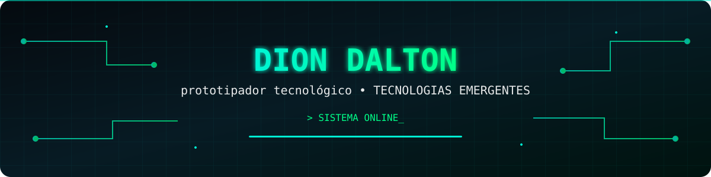

<div align="center">

<a href="https://github.com/SEU_USUARIO">  </a>

<br>


<br><br>

<p>      </p>

</div>
<div align="center">
  
# sobre mim
  
</div>

Sou Dion Dalton, estudante de Ciência da Computação, pesquisador independente e Tech Prototyper.

Tenho interesse na interseção entre software, inteligência artificial, cibersegurança, hardware, prototipação e tecnologias emergentes.

Minha abordagem combina desenvolvimento técnico com Design Thinking, buscando transformar problemas e ideias em protótipos, experimentos e soluções tecnológicas.
<div align="center">

```
┌──────────────────────────────────────────────────────┐
│                   DION_DALTON.EXE                    │
├──────────────────────────────────────────────────────┤
│                                                      │
│  ROLE        → Tech Prototyper                       │
│  FOCUS       → Emerging Technologies                 │
│  LANGUAGE    → Python                                │
│  AI          → Chatbots / Conversational Systems     │
│  SECURITY    → Cybersecurity                         │
│  METHOD      → Design Thinking                       │
│  MINDSET     → Research • Experiment • Build         │
├──────────────────────────────────────────────────────┤
│  STATUS      → SYSTEM ONLINE                         │
└──────────────────────────────────────────────────────┘
```
</div>


<div align="center">

# Áreas e Interesses
Python,	Automação, prototipação e desenvolvimento

Chatbots, IA,	Sistemas conversacionais e experimentação

Cybersecurity	Segurança de sistemas e análise

Tecnologias Emergentes,	Exploração e prototipação

Hardware	Microcomputadores, sistemas físicos e cyberdecks

Design Thinking	Ideação, prototipação e resolução de problemas

Realidade Mista,	Exploração de novas interfaces

Pesquisa e Inovação, Experimentação e desenvolvimento

</div>


<div align="center">
  
# tech stack


Programação

<p>  </p>

AI & Sistemas

<p>    </p>

# Cybersecurity & Research

<p>  </p>

```
current mission [██████████████████████████] 
Researching    [█████████████████████░░░░░]
Learning       [███████████████████████░░░]
Prototyping    [███████████████████░░░░░░░]
Experimenting  [███████████████░░░░░░░░░░░]
Building       [█████████████████░░░░░░░░░]
```


Atualmente estou ampliando minha formação em Ciência da Computação e aprofundando conhecimentos em diferentes áreas do desenvolvimento tecnológico.

Meu objetivo é continuar explorando tecnologias emergentes e construir projetos que conectem software, inteligência artificial, segurança, hardware e experiência humana.
<div align="center">
  
# metodologia

Design Thinking → Prototipar → Costruir → Testar


```
┌───────────────┐
│   Empatizar   │
└───────┬───────┘
↓
┌───────────────┐
│    Definir    │
└───────┬───────┘
↓
┌───────────────┐
│   Idealizar   │
└───────┬───────┘
↓
┌───────────────┐
│   Prototipar  │
└───────┬───────┘
↓
┌───────────────┐
│     Testar    │
└───────┬───────┘
│
                  └──────────→ Iterar
```


</div>
Gosto de trabalhar de forma experimental: entender → imaginar → construir → testar → melhorar.


# project lab

Chatbot Lab

Projetos relacionados a chatbots, automação e sistemas conversacionais.

Stack: Python • AI • APIs • Conversational Systems

Cyber Lab

Experimentos e estudos relacionados a cibersegurança, sistemas, análise e práticas de hacking ético.

Stack: Linux • Python • Bash • Security

Prototype Lab

Projetos experimentais envolvendo hardware, microcomputadores, sensores e tecnologias emergentes.

Stack: Python • Hardware • Embedded Systems

Research Lab

Experimentos envolvendo novas tecnologias, prototipação e pesquisa independente.

Foco: Tecnologias Emergentes • Inovação • Interação Humano-Computador


# github_activity


<div align="center">


</div>

# contribution_matrix

<div align="center">


</div>


# education


Ciência da Computação
Universidade Cruzeiro do Sul
2026 — 2029

Soluções Tecnológicas Emergentes

Python • Chatbots • Design Thinking


# philosophy


<div align="center">

"Aprenda. Experimente. Prototipe. Construa."

<br>

Tecnologia não deve apenas funcionar.
Ela deve resolver problemas, ser compreendida, criar possibilidades
e tornar ideias concretas.

</div>


# connect


<div align="center">

<a href="https://github.com/dion-dalton">  </a>

<a href="https://www.linkedin.com/">  </a>

<a href="https://instagram.com">@dion.dalton.18</a>

<br><br>


</div>

<div align="center">
  
```
╔══════════════════════════════════════════════════╗
║                                                  ║
║              SYSTEM STATUS: ONLINE               ║
║                                                  ║
║       PYTHON • AI • SECURITY • PROTOTYPING       ║
║                                                  ║
╚══════════════════════════════════════════════════╝
```

© Dion Dalton

</div>
